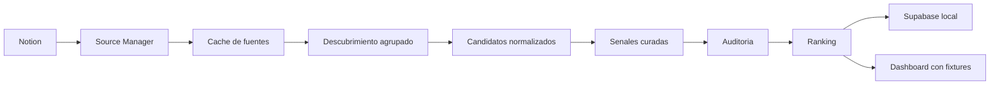

# Estado Actual De AI Radar

Fecha de corte: 29 de julio de 2026.

Este documento registra el estado verificable del producto despues de
incorporar la administracion de fuentes en Notion, la cache local y el flujo de
recoleccion agrupado. Distingue lo implementado de la vision futura.

## Resumen Ejecutivo

AI Radar ya opera como un pipeline editorial local-first:



Notion gobierna que fuentes consultar. El repositorio conserva los datos
procesables y las reglas deterministas. Las skills coordinan el razonamiento,
los scripts validan los contratos y el dashboard presenta una lectura local
trazable.

## Corte Verificable

| Elemento | Estado al corte |
|---|---|
| Catalogo en Notion | 15 fuentes activas y saludables |
| Fuentes oficiales | 5 |
| Repositorios tecnicos | 4 |
| Comunidades | 2 |
| Medios secundarios | 4 |
| Cache local | Version 2, TTL de 24 horas |
| Grupos de recoleccion | 4 grupos deterministas |
| Candidatos del 28 de julio | 14 |
| Senales del 28 de julio | 14: 8 accionables, 4 en evolucion y 2 candidatas |
| Senales del 29 de julio | 1 candidata, sin duplicados ni evidencia vacia |
| Ranking del 28 de julio | 107 senales acumuladas |
| Esquema Supabase local | 6 tablas con RLS y grants explicitos |
| Proyeccion relacional | 325 filas cargadas idempotentemente |
| Dashboard local | Responsive, modos Reader y Operator, fixture versionado |
| Skills canonicas | 7: seis editoriales y una de desarrollo frontend |
| Suite automatizada | 31 pruebas aprobadas |

Los conteos son una fotografia editorial, no una promesa de volumen diario.

## Administrador De Fuentes

La portada operativa se encuentra en
[AI Radar — Centro de operacion y fuentes](https://app.notion.com/p/3ac17079ee1581bd9a0dda605b898701).
La base `AI Radar Sources` contiene:

- identidad: fuente, tipo, URL y descripcion;
- gobierno: activa, prioridad, uso, frecuencia y confianza editorial;
- salud: estado, ultimo exito, fallos consecutivos, feed y ultimo contenido;
- revision humana: ultima revision.

La base ofrece una tabla completa y dos vistas de tablero: `Fuentes por tipo`
y `Salud de fuentes`.

El contrato completo vive en
`skills/ai-radar-source-manager/references/source-contract.md`.

## Responsabilidades De Las Skills

| Skill | Responsabilidad |
|---|---|
| `ai-radar-source-manager` | Sincronizar Notion, validar salud, generar cache y gobernar cambios |
| `ai-radar-source-normalizer` | Convertir entradas heterogeneas en candidatos comparables |
| `ai-radar-signals` | Curar noticias recientes usando el catalogo preparado |
| `ai-radar-signal-reviewer` | Auditar calidad editorial y deduplicacion |
| `ai-radar-ranking-engine` | Puntuar y ordenar senales deterministicamente |
| `ai-radar-test-fixture-builder` | Convertir reglas editoriales en fixtures y pruebas |
| `desarrollo-frontend-airadar` | Implementar y verificar interfaces con datos trazables, estados completos, accesibilidad y evidencia visual |

`ai-radar-signals` no consulta ni modifica Notion directamente. Consume
`config/sources.json` en modo de solo lectura.

La skill frontend establece las puertas de calidad de la interfaz. El dashboard
ya forma parte de los artefactos versionados en `frontend/`, consume snapshots
y rankings locales y explicita que no representa datos en tiempo real. Todavia
no esta conectado a Supabase ni desplegado.

## Cache Y Continuidad

`config/sources.json` es una cache operativa ignorada por Git:

- `version`: 2;
- TTL: 24 horas;
- origen: Notion;
- orden: tipo y nombre;
- grupos: oficiales, repositorios, comunidades y medios;
- contenido: solo fuentes activas validadas.

Estados de ejecucion:

- `fresh`: Notion respondio y el catalogo completo fue validado;
- `fallback-cache`: Notion fallo y se uso la ultima cache valida;
- `fallback-no-cache`: Notion fallo y no existe cache util.

Una falla temporal nunca debe sobrescribir una cache valida.

## Cadencia De Operacion

| Momento | Accion |
|---|---|
| Antes de la primera busqueda del dia | Sincronizar Notion si la cache vencio |
| Semanal | Comprobar salud, redirecciones y contenido reciente |
| Mensual | Descubrir y normalizar nuevas fuentes |
| Trimestral | Revisar cobertura, ruido, duplicados y fuentes degradadas |

Las altas, bajas y modificaciones editoriales sensibles requieren aprobacion
humana. La skill no se ejecuta sola: una automatizacion o el flujo editorial
debe invocarla con esta cadencia.

## Validacion

Comandos de control:

```bash
python3 skills/ai-radar-source-manager/scripts/validate_sources_cache.py config/sources.json
python3 scripts/airadar.py validate --date 2026-07-29
python3 scripts/airadar.py audit --date 2026-07-29
python3 scripts/airadar.py persistence
python3 scripts/load_supabase.py
python3 scripts/load_supabase.py --local --apply
python3 scripts/check_skill_sync.py
python3 -m unittest
python3 -m http.server 8000
```

Resultado del corte:

- cache valida con 15 fuentes;
- snapshot del 29 de julio valido;
- sin duplicados ni evidencia vacia en ese snapshot;
- 31 pruebas aprobadas;
- siete skills canonicas sincronizadas con las copias activas de Codex;
- migracion Supabase aplicada sin errores en Postgres local;
- lint y asesores locales sin hallazgos;
- dos cargas consecutivas conservaron los mismos conteos: 23 snapshots, 108
  senales, 3 rankings, 167 entradas de ranking, 2 lotes y 22 candidatos;
- los roles publicos pueden leer datos publicados y no tienen privilegios sobre
  candidatos internos;
- dashboard validado en escritorio y 369 x 799, con modos Reader y Operator,
  paginacion, busqueda, estado vacio, estado de error y consola sin errores;
- capturas verificables conservadas en `frontend/evidence/`.

## Decisiones Pendientes

- Verificar feeds RSS o APIs antes de completar `Feed URL`.
- Registrar `Ultimo contenido detectado` durante comprobaciones reales.
- Definir una automatizacion concreta para la sincronizacion diaria y la
  revision semanal.
- Crear el proyecto Supabase remoto en la organizacion aprobada, aplicar la
  migracion y cargar la proyeccion validada.
- Conectar el dashboard a las lecturas publicas de Supabase conservando el
  fixture local como fallback verificable.
- Definir el destino y desplegar el dashboard.
- Definir y desplegar las Vercel Functions que realmente requieran acceso
  privilegiado; las lecturas publicas pueden usar la Data API con RLS.

## Regla De Documentacion

Cada cambio material debe actualizar como minimo:

1. el contrato o modelo operativo afectado;
2. las pruebas o validaciones deterministas;
3. esta fotografia si cambia una capacidad o decision;
4. la portada de Notion si cambia el estado visible del producto.
