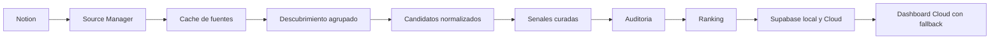

# Estado Actual De AI Radar

Fecha de corte: 31 de julio de 2026.

Este documento registra el estado verificable del producto despues de
incorporar la administracion de fuentes en Notion, la cache local y el flujo de
recoleccion agrupado. Distingue lo implementado de la vision futura.

## Resumen Ejecutivo

AI Radar ya opera como un pipeline editorial local-first:



Notion gobierna que fuentes consultar. El repositorio conserva los datos
procesables y las reglas deterministas. Las skills coordinan el razonamiento,
los scripts validan los contratos y el dashboard presenta una lectura Cloud
con fallback local trazable.

## Corte Verificable

| Elemento | Estado al corte |
|---|---|
| Catalogo en Notion | 16 fuentes activas y saludables |
| Fuentes oficiales | 6 |
| Repositorios tecnicos | 4 |
| Comunidades | 2 |
| Medios secundarios | 4 |
| Cache local | Version 2, TTL de 24 horas |
| Grupos de recoleccion | 4 grupos deterministas |
| Candidatos del 28 de julio | 14 |
| Senales del 28 de julio | 14: 8 accionables, 4 en evolucion y 2 candidatas |
| Senales del 29 de julio | 1 candidata, sin duplicados ni evidencia vacia |
| Senales del 30 de julio | 7: 2 accionables y 5 candidatas, sin duplicados ni evidencia vacia |
| Ranking del 30 de julio | 115 senales acumuladas |
| Esquema Supabase local | 6 tablas con RLS y grants explicitos |
| Supabase Cloud | Proyecto `AI Radar`, `us-east-1`, saludable |
| Proyeccion relacional | 449 filas en local y Cloud |
| Dashboard | Cloud primero, fallback local, cinco secciones, notificaciones, modos Reader y Operator |
| Skills canonicas | 8: seis editoriales, una de frontend y una de auditoria end-to-end |
| Migraciones Supabase | 4 migraciones versionadas |
| Evidencia visual | 12 capturas versionadas |
| Observabilidad de fuentes | Contrato y CLI para bloqueos HTTP y descartes por fecha no verificable |
| Suite automatizada | 44 pruebas aprobadas |

Los conteos son una fotografia editorial, no una promesa de volumen diario.

## Administrador De Fuentes

La portada operativa se encuentra en
[AI Radar — Centro de operacion y fuentes](https://app.notion.com/p/3ac17079ee1581bd9a0dda605b898701).
La base `AI Radar Sources` contiene:

- identidad: fuente, tipo, URL y descripcion;
- gobierno: activa, prioridad, uso, frecuencia y confianza editorial;
- salud: estado, ultimo exito, fallos consecutivos, feed y ultimo contenido;
- revision humana: ultima revision.

La base ofrece una tabla completa y dos vistas de tablero: `Fuentes por tipo`
y `Salud de fuentes`.

El contrato completo vive en
`skills/ai-radar-source-manager/references/source-contract.md`.

## Responsabilidades De Las Skills

| Skill | Responsabilidad |
|---|---|
| `ai-radar-source-manager` | Sincronizar Notion, validar salud, generar cache y gobernar cambios |
| `ai-radar-source-normalizer` | Convertir entradas heterogeneas en candidatos comparables |
| `ai-radar-signals` | Curar noticias recientes usando el catalogo preparado |
| `ai-radar-signal-reviewer` | Auditar calidad editorial y deduplicacion |
| `ai-radar-ranking-engine` | Puntuar y ordenar senales deterministicamente |
| `ai-radar-test-fixture-builder` | Convertir reglas editoriales en fixtures y pruebas |
| `desarrollo-frontend-airadar` | Implementar y verificar interfaces con datos trazables, estados completos, accesibilidad y evidencia visual |
| `ai-radar-use-case-auditor` | Ejecutar casos de uso end-to-end, preservar evidencia y crear issues reproducibles |

`ai-radar-signals` no consulta ni modifica Notion directamente. Consume
`config/sources.json` en modo de solo lectura.

La skill frontend establece las puertas de calidad de la interfaz. El dashboard
ya forma parte de los artefactos versionados en `frontend/`, consulta Supabase
Cloud y conserva los snapshots y rankings locales como fallback explicito.
Todavia no esta desplegado.

## Cache Y Continuidad

`config/sources.json` es una cache operativa ignorada por Git:

- `version`: 2;
- TTL: 24 horas;
- origen: Notion;
- orden: tipo y nombre;
- grupos: oficiales, repositorios, comunidades y medios;
- contenido: solo fuentes activas validadas.

Estados de ejecucion:

- `fresh`: Notion respondio y el catalogo completo fue validado;
- `fallback-cache`: Notion fallo y se uso la ultima cache valida;
- `fallback-no-cache`: Notion fallo y no existe cache util.

Una falla temporal nunca debe sobrescribir una cache valida.

## Cadencia De Operacion

| Momento | Accion |
|---|---|
| Antes de la primera busqueda del dia | Sincronizar Notion si la cache vencio |
| Semanal | Comprobar salud, redirecciones y contenido reciente |
| Mensual | Descubrir y normalizar nuevas fuentes |
| Trimestral | Revisar cobertura, ruido, duplicados y fuentes degradadas |

Las altas, bajas y modificaciones editoriales sensibles requieren aprobacion
humana. La skill no se ejecuta sola: una automatizacion o el flujo editorial
debe invocarla con esta cadencia.

## Validacion

Comandos de control:

```bash
python3 skills/ai-radar-source-manager/scripts/validate_sources_cache.py config/sources.json
python3 scripts/airadar.py validate --date 2026-07-29
python3 scripts/airadar.py audit --date 2026-07-29
python3 scripts/airadar.py persistence
python3 scripts/load_supabase.py
python3 scripts/load_supabase.py --local --apply
python3 scripts/check_skill_sync.py
python3 scripts/check_documentation_sync.py
python3 -m unittest
python3 -m http.server 8000
```

Resultado del corte:

- cache valida con 16 fuentes;
- snapshots del 29 y 30 de julio validos;
- sin duplicados ni evidencia vacia en el snapshot del 30 de julio;
- 44 pruebas aprobadas;
- 8 skills canonicas sincronizadas con las copias activas de Codex;
- cuatro migraciones Supabase versionadas;
- migracion Supabase aplicada sin errores en Postgres local;
- lint y asesores locales sin hallazgos;
- la proyeccion local y Cloud conserva 24 snapshots, 115 senales, 4 rankings,
  282 entradas de ranking, 2 lotes y 22 candidatos: 449 filas en total;
- los roles publicos pueden leer datos publicados y no tienen privilegios sobre
  candidatos internos;
- proyecto Cloud `xredenxxhnzkmfxxnrlg` activo y saludable en `us-east-1`;
- 449 filas verificadas en Cloud y asesores de seguridad sin hallazgos;
- dashboard validado con datos Cloud, fallback local, modos Reader y Operator,
  paginacion, estado vacio, estado de error y consola sin errores;
- 12 capturas verificables conservadas en `frontend/evidence/`;
- navegacion operativa para Radar, Rankings, Fuentes, Evidencia y Revisiones;
- panel de notificaciones con conteo real, teclado y estado vacio por sesion;
- bloqueos HTTP y descartes por fecha no verificable registrados mediante
  `scripts/record_source_finding.py`;
- README y documentos canonicos validados con
  `scripts/check_documentation_sync.py`.

## Decisiones Pendientes

- Verificar feeds RSS o APIs antes de completar `Feed URL`.
- Registrar `Ultimo contenido detectado` durante comprobaciones reales.
- Definir una automatizacion concreta para la sincronizacion diaria y la
  revision semanal.
- Definir el destino y desplegar el dashboard.
- Definir y desplegar las Vercel Functions que realmente requieran acceso
  privilegiado; las lecturas publicas pueden usar la Data API con RLS.
- Publicar la rama local auditada y desplegar el dashboard cuando se resuelva
  el flujo de autenticacion del repositorio.

## Regla De Documentacion

Cada cambio material debe actualizar como minimo:

1. el contrato o modelo operativo afectado;
2. las pruebas o validaciones deterministas;
3. esta fotografia si cambia una capacidad o decision;
4. README y los documentos especializados afectados;
5. la portada de Notion si cambia el estado visible del producto;
6. ejecutar `scripts/check_skill_sync.py`,
   `scripts/check_documentation_sync.py` y `python3 -m unittest`.
