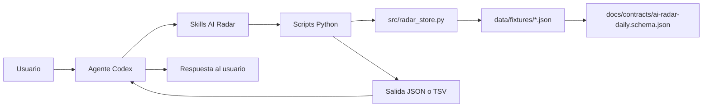
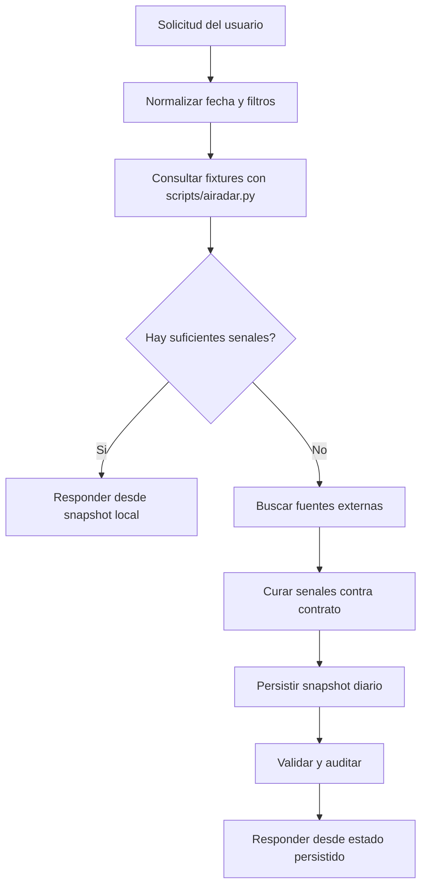
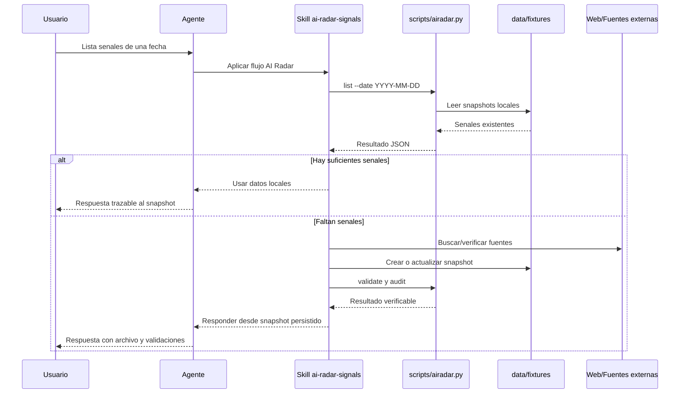
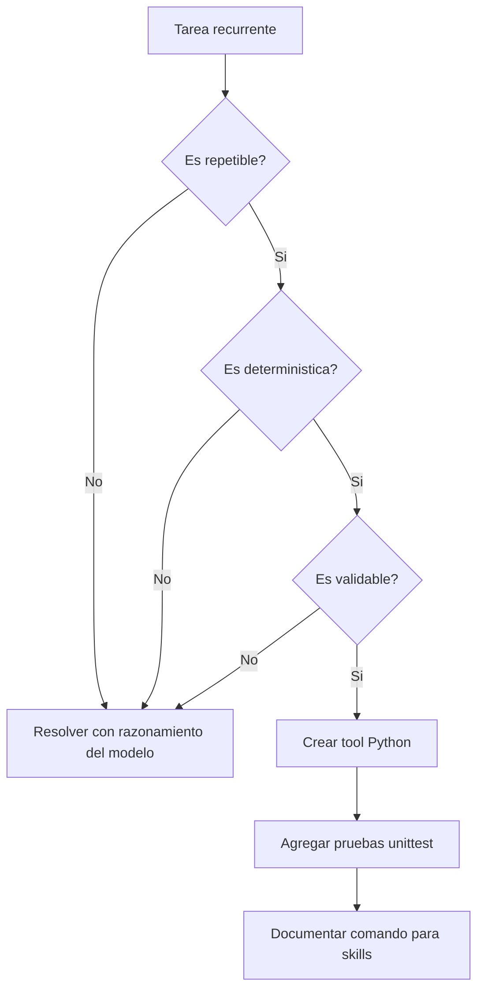
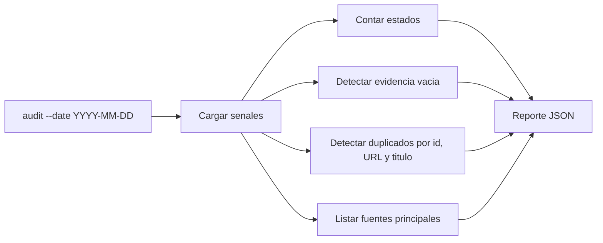
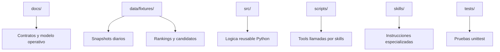
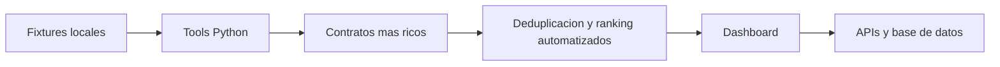

# Modelo Operativo de AI Radar

Este documento explica que hacemos en AI Radar, como lo hacemos y donde viven
las capacidades del proyecto. La regla central es simple: el modelo decide
cuando actuar, pero las tareas repetibles, deterministicas y validables se
convierten en herramientas Python.

## Objetivo

AI Radar convierte noticias, papers, repositorios, herramientas y lanzamientos
de IA en senales accionables para builders. Una senal debe responder:

- que paso,
- que fuente lo sostiene,
- que evidencia concreta existe,
- por que importa,
- que accion sugiere,
- en que estado editorial queda.

## Mapa Del Sistema



El agente no debe leer y razonar sobre todos los JSON si existe una herramienta
local que puede calcular el resultado. Las skills llaman scripts Python
directamente para consultar, validar o auditar datos.

## Flujo Local-First

Toda solicitud consultable por fecha, tag, fuente, estado, impacto o texto debe
empezar en la base local.



Comando base:

```bash
python3 scripts/airadar.py list --date YYYY-MM-DD --limit N --format json
```

## Ciclo De Curacion



## Cuando Convertir Una Tarea En Tool

Una tarea se convierte en herramienta cuando cumple tres condiciones:

- `repetible`: aparece mas de una vez en el flujo de trabajo.
- `deterministica`: la misma entrada produce la misma salida.
- `validable`: podemos probar o verificar el resultado.



Ejemplos que ya son tool:

- listar senales por fecha,
- resumir conteos,
- mostrar una senal por `id`,
- validar snapshots,
- auditar duplicados, evidencia vacia, estados y fuentes.

## Capacidades Actuales

| Capacidad | Comando | Uso |
|---|---|---|
| Listar senales | `python3 scripts/airadar.py list --date YYYY-MM-DD` | Consultar fixtures antes de buscar fuera. |
| Resumir radar | `python3 scripts/airadar.py summary --from YYYY-MM-DD` | Obtener conteos por fecha, impacto, estado, fuente y tags. |
| Mostrar senal | `python3 scripts/airadar.py show SIGNAL_ID` | Revisar una senal completa o campos puntuales. |
| Ranking | `python3 scripts/airadar.py ranking --date YYYY-MM-DD` | Consultar ranking editorial si existe fixture. |
| Validacion | `python3 scripts/airadar.py validate --date YYYY-MM-DD` | Revisar estructura minima del snapshot. |
| Auditoria | `python3 scripts/airadar.py audit --date YYYY-MM-DD` | Detectar duplicados, evidencia vacia, estados y fuentes. |

## Flujo De Auditoria



La auditoria reduce tokens porque evita que el modelo lea snapshots completos
para tareas mecanicas. El modelo solo interpreta el reporte y decide el
siguiente paso editorial.

## Estructura Operativa



## Reglas De Trabajo

- Consultar local antes de buscar en internet.
- Persistir informacion nueva antes de usarla como respuesta del radar.
- Usar scripts Python directamente desde skills.
- Convertir tareas mecanicas en tools.
- Probar tools con `unittest`.
- Validar JSON con `jq` cuando se editen fixtures o contratos.
- No guardar articulos completos, secretos ni salidas generadas no revisadas.

## Camino De Evolucion



El proyecto debe crecer por capas. Primero se estabiliza el contrato local y
las tools; despues se conectan fuentes externas, UI, APIs o base de datos.
