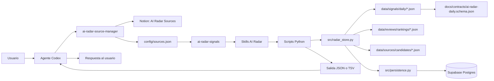
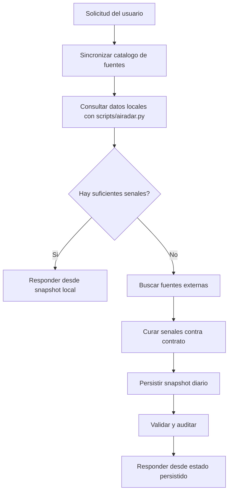
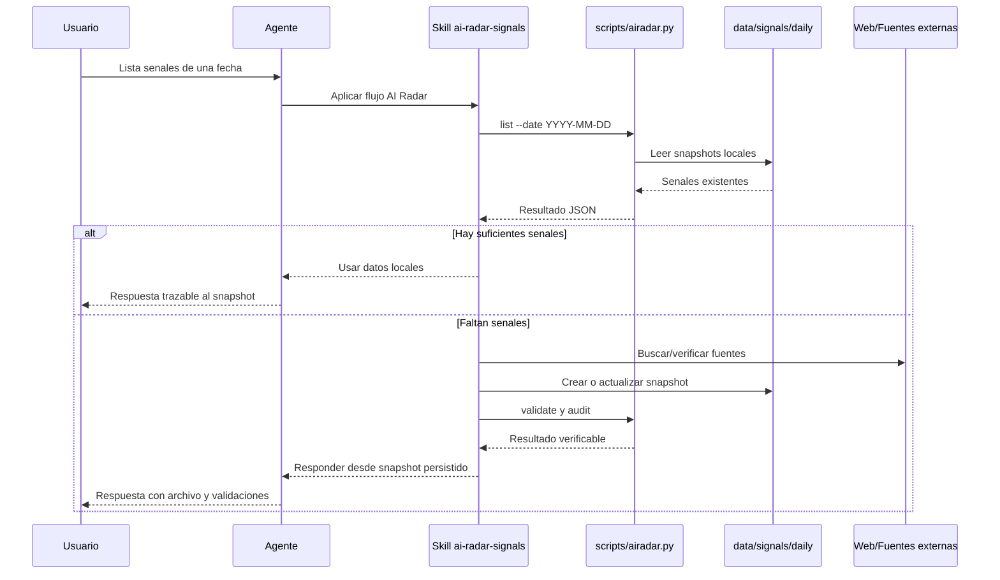
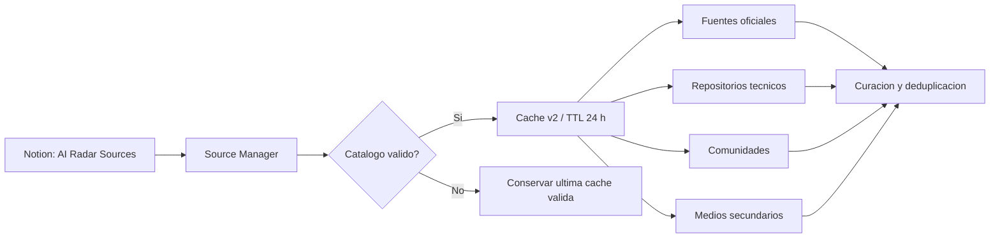
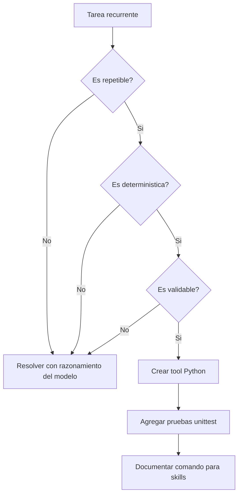
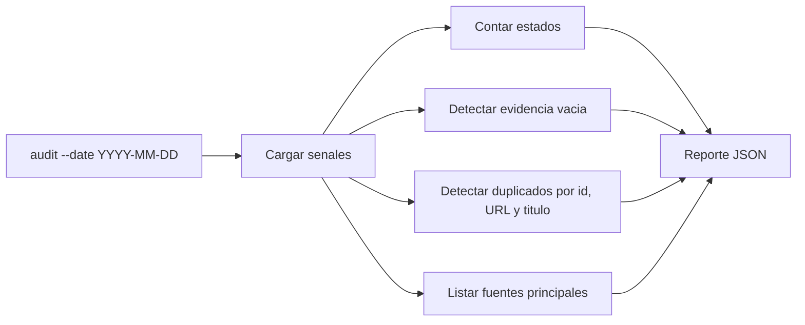
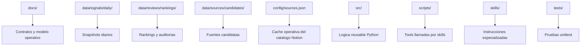
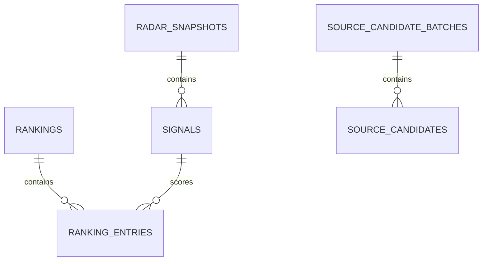
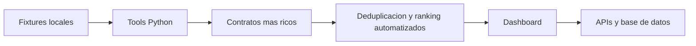

# Modelo Operativo de AI Radar

Este documento explica que hacemos en AI Radar, como lo hacemos y donde viven
las capacidades del proyecto. La regla central es simple: el modelo decide
cuando actuar, pero las tareas repetibles, deterministicas y validables se
convierten en herramientas Python.

## Objetivo

AI Radar convierte noticias, papers, repositorios, herramientas y lanzamientos
de IA en senales accionables para builders. Una senal debe responder:

- que paso,
- que fuente lo sostiene,
- que evidencia concreta existe,
- por que importa,
- que accion sugiere,
- en que estado editorial queda.

## Mapa Del Sistema



El agente no debe leer y razonar sobre todos los JSON si existe una herramienta
local que puede calcular el resultado. Las skills llaman scripts Python
directamente para consultar, validar o auditar datos.

## Flujo Local-First

Toda solicitud consultable por fecha, tag, fuente, estado, impacto o texto debe
empezar en la base local.



La sincronizacion consulta Notion antes de la primera recoleccion editorial del
dia. Si Notion no responde, conserva la ultima cache valida y reporta
`fallback-cache`; si tampoco existe cache, reporta `fallback-no-cache`.

Comando base:

```bash
python3 scripts/airadar.py list --date YYYY-MM-DD --limit N --format json
```

## Ciclo De Curacion



## Administracion De Fuentes

Notion `AI Radar Sources` es la fuente maestra. La skill
`ai-radar-source-manager` valida el catalogo y genera `config/sources.json`,
que `ai-radar-signals` consume en modo de solo lectura.



Cadencia recomendada:

| Operacion | Frecuencia | Resultado |
|---|---|---|
| Sincronizacion | Diaria o cache mayor a 24 horas | Catalogo fresco o fallback explicito |
| Salud | Semanal | Disponibilidad, fallos y contenido reciente |
| Descubrimiento | Mensual | Nuevas fuentes candidatas normalizadas |
| Revision editorial | Trimestral | Cobertura, ruido, duplicados y decisiones humanas |

Altas, desactivaciones y cambios de URL o categoria requieren aprobacion
humana. Las metricas de salud comprobadas pueden actualizarse
automaticamente.

## Cuando Convertir Una Tarea En Tool

Una tarea se convierte en herramienta cuando cumple tres condiciones:

- `repetible`: aparece mas de una vez en el flujo de trabajo.
- `deterministica`: la misma entrada produce la misma salida.
- `validable`: podemos probar o verificar el resultado.



Ejemplos que ya son tool:

- listar senales por fecha,
- resumir conteos,
- mostrar una senal por `id`,
- validar snapshots,
- auditar duplicados, evidencia vacia, estados y fuentes.

## Capacidades Actuales

| Capacidad | Comando | Uso |
|---|---|---|
| Listar senales | `python3 scripts/airadar.py list --date YYYY-MM-DD` | Consultar datos locales antes de buscar fuera. |
| Resumir radar | `python3 scripts/airadar.py summary --from YYYY-MM-DD` | Obtener conteos por fecha, impacto, estado, fuente y tags. |
| Mostrar senal | `python3 scripts/airadar.py show SIGNAL_ID` | Revisar una senal completa o campos puntuales. |
| Ranking | `python3 scripts/airadar.py ranking --date YYYY-MM-DD` | Consultar ranking editorial si existe fixture. |
| Validacion | `python3 scripts/airadar.py validate --date YYYY-MM-DD` | Revisar estructura minima del snapshot. |
| Auditoria | `python3 scripts/airadar.py audit --date YYYY-MM-DD` | Detectar duplicados, evidencia vacia, estados y fuentes. |
| Catalogo de fuentes | `python3 skills/ai-radar-source-manager/scripts/validate_sources_cache.py config/sources.json` | Validar TTL, propiedades, URLs, orden y grupos. |
| Preparar persistencia | `python3 scripts/airadar.py persistence` | Validar relaciones y contar registros antes de cargar. |
| Cargar Supabase | `python3 scripts/load_supabase.py --apply` | Ejecutar upserts idempotentes usando una clave secreta de servidor. |

## Flujo De Auditoria



La auditoria reduce tokens porque evita que el modelo lea snapshots completos
para tareas mecanicas. El modelo solo interpreta el reporte y decide el
siguiente paso editorial.

## Estructura Operativa



## Reglas De Trabajo

- Consultar local antes de buscar en internet.
- Informar que se reviso el estado local y justificar la busqueda externa antes
  de iniciarla.
- Persistir informacion nueva antes de usarla como respuesta del radar.
- Usar scripts Python directamente desde skills.
- Convertir tareas mecanicas en tools.
- Probar tools con `unittest`.
- Validar JSON con `jq` cuando se editen datos locales o contratos.
- No guardar articulos completos, secretos ni salidas generadas no revisadas.
- Mantener las migraciones Supabase en Git y aplicar el mismo esquema en todos
  los entornos.
- No exponer `SUPABASE_SECRET_KEY` ni `SUPABASE_SERVICE_ROLE_KEY` al navegador.
- Habilitar RLS en todas las tablas `public` y combinar politicas con grants
  explicitos.

## Persistencia Relacional



Los JSON versionados siguen siendo la evidencia editorial auditable. La base
Supabase es una proyeccion relacional idempotente para consultas del dashboard
y futuras APIs. `radar_snapshots`, `signals`, `rankings` y `ranking_entries`
son de lectura publica; `source_candidate_batches` y `source_candidates`
permanecen internos.

## Sincronizacion De Las Skills Activas

Las versiones canonicas de `ai-radar-signals` y
`ai-radar-source-manager` viven en el repositorio. Cuando cambien,
sincronizarlas con las copias activas de Codex y reiniciar la aplicacion para
que una sesion nueva cargue las instrucciones actualizadas:

```bash
diff -u ~/.codex/skills/ai-radar-signals/SKILL.md \
  skills/ai-radar-signals/SKILL.md
cp skills/ai-radar-signals/SKILL.md \
  ~/.codex/skills/ai-radar-signals/SKILL.md
cp -R skills/ai-radar-source-manager \
  ~/.codex/skills/ai-radar-source-manager
```

Despues de copiar, volver a ejecutar `diff`. Una salida vacia confirma que la
skill instalada coincide con la fuente canonica.

## Camino De Evolucion



El proyecto debe crecer por capas. Primero se estabiliza el contrato local y
las tools; despues se conectan fuentes externas, UI, APIs o base de datos.
